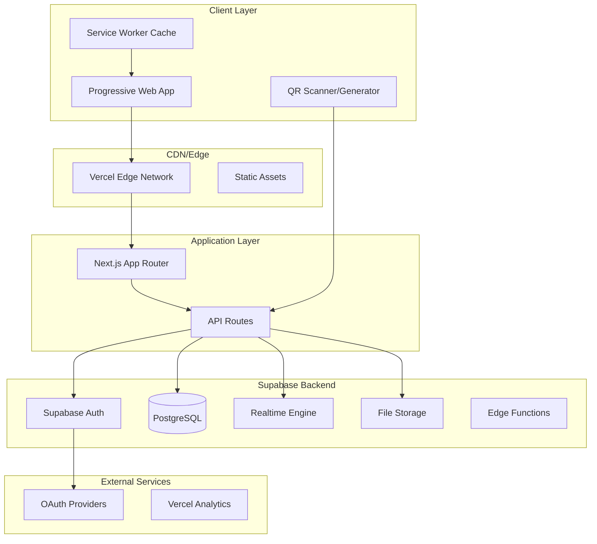
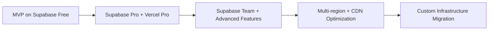

# Trust Play - Technical Architecture Analysis

## Executive Summary

This document outlines the technical architecture for Trust Play, a community-based football player rating platform designed to scale from local communities to national/international deployment while maintaining cost-effectiveness and technical simplicity.

## Platform Recommendation: Progressive Web App (PWA)

**Recommended Platform**: Progressive Web App (PWA) using Next.js

### Why PWA is Optimal:
- **Single Codebase**: One application for web and mobile platforms
- **Cost-Effective**: Eliminates need for separate native app development
- **Native-Like Experience**: App-like interface with offline capabilities
- **QR Code Integration**: Native web APIs for camera access and QR scanning
- **SEO Benefits**: Discoverable through search engines for community growth
- **Instant Deployment**: No app store approval delays
- **Automatic Updates**: Users always have the latest version

## Technology Stack

### Frontend Layer
```
Next.js 15 (App Router) + TypeScript
├── UI Framework: Tailwind CSS + Radix UI (shadcn/ui)
├── State Management: Zustand (lightweight state management)
├── Real-time: Supabase Realtime
├── QR Code: qr-code-generator + qr-scanner
├── PWA: next-pwa
├── Charts/Analytics: Recharts
└── Authentication: Supabase Auth
```

### Backend Layer (Supabase-First Approach)
```
Supabase Backend-as-a-Service
├── Database: PostgreSQL (managed by Supabase)
├── Authentication: Supabase Auth + OAuth providers
├── Real-time: Supabase Realtime subscriptions
├── Storage: Supabase Storage (for avatars, assets)
├── Edge Functions: Supabase Edge Functions (Deno runtime)
├── API: Auto-generated REST + GraphQL APIs
└── Row Level Security: Built-in authorization
```

### Infrastructure & Deployment
```
Vercel (Frontend Hosting)
├── Database: Supabase PostgreSQL
├── Backend Services: Supabase (Auth, Realtime, Storage)
├── Monitoring: Vercel Analytics + Supabase Dashboard
├── CDN: Vercel Edge Network
└── Domain: Custom domain with SSL
```

## Database Design Architecture

### Core Tables Schema

```sql
-- Users table (managed by Supabase Auth)
CREATE TABLE profiles (
  id UUID REFERENCES auth.users(id) PRIMARY KEY,
  email TEXT UNIQUE NOT NULL,
  name TEXT NOT NULL,
  avatar_url TEXT,
  created_at TIMESTAMP WITH TIME ZONE DEFAULT NOW(),
  updated_at TIMESTAMP WITH TIME ZONE DEFAULT NOW()
);

-- Sessions table
CREATE TABLE sessions (
  id UUID DEFAULT gen_random_uuid() PRIMARY KEY,
  creator_id UUID REFERENCES profiles(id) NOT NULL,
  title TEXT NOT NULL,
  description TEXT,
  location TEXT,
  match_date TIMESTAMP WITH TIME ZONE NOT NULL,
  status TEXT DEFAULT 'active' CHECK (status IN ('active', 'closed')),
  qr_data JSONB,
  created_at TIMESTAMP WITH TIME ZONE DEFAULT NOW(),
  closed_at TIMESTAMP WITH TIME ZONE
);

-- Session participants
CREATE TABLE session_participants (
  id UUID DEFAULT gen_random_uuid() PRIMARY KEY,
  session_id UUID REFERENCES sessions(id) ON DELETE CASCADE,
  user_id UUID REFERENCES profiles(id) ON DELETE CASCADE,
  role TEXT DEFAULT 'player' CHECK (role IN ('creator', 'player')),
  joined_at TIMESTAMP WITH TIME ZONE DEFAULT NOW(),
  UNIQUE(session_id, user_id)
);

-- Ratings table (simplified system)
CREATE TABLE ratings (
  id UUID DEFAULT gen_random_uuid() PRIMARY KEY,
  session_id UUID REFERENCES sessions(id) ON DELETE CASCADE,
  rater_id UUID REFERENCES profiles(id) ON DELETE CASCADE,
  rated_id UUID REFERENCES profiles(id) ON DELETE CASCADE,
  overall_score INTEGER CHECK (overall_score >= 1 AND overall_score <= 10),
  play_type TEXT CHECK (play_type IN ('fun', 'competitive', 'fair_play', 'technical', 'social', 'reliable')),
  comment TEXT,
  created_at TIMESTAMP WITH TIME ZONE DEFAULT NOW(),
  UNIQUE(session_id, rater_id, rated_id)
);

-- User statistics (computed/cached)
CREATE TABLE user_stats (
  id UUID DEFAULT gen_random_uuid() PRIMARY KEY,
  user_id UUID REFERENCES profiles(id) ON DELETE CASCADE,
  session_id UUID REFERENCES sessions(id) ON DELETE CASCADE,
  avg_overall_rating DECIMAL(3,2),
  play_type_distribution JSONB DEFAULT '{}', -- Stores percentage breakdown of play types
  total_ratings INTEGER DEFAULT 0,
  achievements JSONB DEFAULT '[]',
  updated_at TIMESTAMP WITH TIME ZONE DEFAULT NOW(),
  UNIQUE(user_id, session_id)
);

-- Play type aggregation view
CREATE TABLE user_play_type_stats (
  id UUID DEFAULT gen_random_uuid() PRIMARY KEY,
  user_id UUID REFERENCES profiles(id) ON DELETE CASCADE,
  play_type TEXT NOT NULL,
  count INTEGER DEFAULT 0,
  percentage DECIMAL(5,2) DEFAULT 0,
  updated_at TIMESTAMP WITH TIME ZONE DEFAULT NOW(),
  UNIQUE(user_id, play_type)
);
```

### Row Level Security (RLS) Policies

```sql
-- Profiles: Users can read all profiles, update only their own
ALTER TABLE profiles ENABLE ROW LEVEL SECURITY;

CREATE POLICY "Profiles are viewable by everyone" ON profiles
  FOR SELECT USING (true);

CREATE POLICY "Users can update own profile" ON profiles
  FOR UPDATE USING (auth.uid() = id);

-- Sessions: Public read, authenticated create
ALTER TABLE sessions ENABLE ROW LEVEL SECURITY;

CREATE POLICY "Sessions are viewable by everyone" ON sessions
  FOR SELECT USING (true);

CREATE POLICY "Authenticated users can create sessions" ON sessions
  FOR INSERT WITH CHECK (auth.role() = 'authenticated');

-- Ratings: Users can rate others in sessions they participate in
ALTER TABLE ratings ENABLE ROW LEVEL SECURITY;

CREATE POLICY "Users can view ratings in their sessions" ON ratings
  FOR SELECT USING (
    EXISTS (
      SELECT 1 FROM session_participants 
      WHERE session_id = ratings.session_id 
      AND user_id = auth.uid()
    )
  );

CREATE POLICY "Users can create ratings in sessions they joined" ON ratings
  FOR INSERT WITH CHECK (
    auth.uid() = rater_id AND
    EXISTS (
      SELECT 1 FROM session_participants 
      WHERE session_id = ratings.session_id 
      AND user_id = auth.uid()
    )
  );
```

## System Architecture Overview



## Key Features Implementation

### 1. Real-time Rating System

```typescript
// Supabase Realtime subscription for live session updates
const supabase = createClient(supabaseUrl, supabaseKey);

// Subscribe to session changes
const sessionSubscription = supabase
  .channel('session-updates')
  .on(
    'postgres_changes',
    {
      event: '*',
      schema: 'public',
      table: 'ratings',
      filter: `session_id=eq.${sessionId}`
    },
    (payload) => {
      // Update UI with new rating
      handleNewRating(payload.new);
    }
  )
  .subscribe();

// Subscribe to participant changes
const participantSubscription = supabase
  .channel('participant-updates')
  .on(
    'postgres_changes',
    {
      event: 'INSERT',
      schema: 'public',
      table: 'session_participants',
      filter: `session_id=eq.${sessionId}`
    },
    (payload) => {
      // Update participant list
      handleNewParticipant(payload.new);
    }
  )
  .subscribe();
```

### 2. Simplified Rating Interface

```typescript
// Rating submission interface
interface RatingSubmission {
  sessionId: string;
  ratedUserId: string;
  overallScore: number; // 1-10 scale
  playType: 'fun' | 'competitive' | 'fair_play' | 'technical' | 'social' | 'reliable';
  comment?: string;
}

// Rating component implementation
const RatingForm = ({ sessionId, ratedUser }: RatingFormProps) => {
  const [overallScore, setOverallScore] = useState<number>(5);
  const [playType, setPlayType] = useState<string>('');

  const playTypeOptions = [
    { value: 'fun', label: 'Fun', description: 'Entertaining, creative, brings joy to the game' },
    { value: 'competitive', label: 'Competitive', description: 'Driven, focused on winning, high intensity' },
    { value: 'fair_play', label: 'Fair Play', description: 'Respectful, follows rules, good sportsmanship' },
    { value: 'technical', label: 'Technical', description: 'Skilled, precise, tactically aware' },
    { value: 'social', label: 'Social', description: 'Team-oriented, supportive, great communication' },
    { value: 'reliable', label: 'Reliable', description: 'Consistent, dependable, steady performance' }
  ];

  const submitRating = async () => {
    const rating: RatingSubmission = {
      sessionId,
      ratedUserId: ratedUser.id,
      overallScore,
      playType,
      comment
    };

    await supabase.from('ratings').insert(rating);
  };

  return (
    <div className="rating-form">
      {/* Overall Rating Slider */}
      <div className="overall-rating">
        <label>Overall Rating: {overallScore}/10</label>
        <input
          type="range"
          min="1"
          max="10"
          step="0.5"
          value={overallScore}
          onChange={(e) => setOverallScore(Number(e.target.value))}
        />
      </div>

      {/* Play Type Selection */}
      <div className="play-type-selection">
        <label>Play Type:</label>
        {playTypeOptions.map((option) => (
          <div key={option.value} className="play-type-option">
            <input
              type="radio"
              id={option.value}
              name="playType"
              value={option.value}
              checked={playType === option.value}
              onChange={(e) => setPlayType(e.target.value)}
            />
            <label htmlFor={option.value}>
              <strong>{option.label}</strong>
              <span className="description">{option.description}</span>
            </label>
          </div>
        ))}
      </div>

      <button onClick={submitRating} disabled={!playType}>
        Submit Rating
      </button>
    </div>
  );
};
```

### 3. QR Code System with Security

```typescript
// QR Code generation with signed payload
interface QRPayload {
  sessionId: string;
  creatorId: string;
  expires: number;
  signature: string;
}

// Generate secure QR code
async function generateSessionQR(sessionId: string, creatorId: string) {
  const payload: QRPayload = {
    sessionId,
    creatorId,
    expires: Date.now() + (24 * 60 * 60 * 1000), // 24 hours
    signature: await signPayload({ sessionId, creatorId })
  };
  
  const qrData = btoa(JSON.stringify(payload));
  const qrUrl = `${baseUrl}/join/${qrData}`;
  
  return generateQRCode(qrUrl);
}

// Verify QR code on scan
async function verifyQRPayload(qrData: string): Promise<boolean> {
  try {
    const payload: QRPayload = JSON.parse(atob(qrData));
    
    // Check expiration
    if (Date.now() > payload.expires) return false;
    
    // Verify signature
    const expectedSignature = await signPayload({
      sessionId: payload.sessionId,
      creatorId: payload.creatorId
    });
    
    return payload.signature === expectedSignature;
  } catch {
    return false;
  }
}
```

### 4. Play Type Analytics and Aggregation

```typescript
// Supabase Edge Function for play type aggregation
export async function calculatePlayTypeDistribution(userId: string) {
  const { data: ratings } = await supabase
    .from('ratings')
    .select('play_type')
    .eq('rated_id', userId);

  const playTypeCounts = ratings.reduce((acc, rating) => {
    acc[rating.play_type] = (acc[rating.play_type] || 0) + 1;
    return acc;
  }, {} as Record<string, number>);

  const totalRatings = ratings.length;
  const distribution = Object.entries(playTypeCounts).reduce((acc, [type, count]) => {
    acc[type] = Math.round((count / totalRatings) * 100);
    return acc;
  }, {} as Record<string, number>);

  // Update user stats
  await supabase
    .from('user_stats')
    .upsert({
      user_id: userId,
      play_type_distribution: distribution,
      total_ratings: totalRatings,
      updated_at: new Date().toISOString()
    });

  return distribution;
}

// React component for displaying play type distribution
const PlayTypeChart = ({ userId }: { userId: string }) => {
  const [distribution, setDistribution] = useState<Record<string, number>>({});

  useEffect(() => {
    loadPlayTypeDistribution();
  }, [userId]);

  const loadPlayTypeDistribution = async () => {
    const { data } = await supabase
      .from('user_stats')
      .select('play_type_distribution')
      .eq('user_id', userId)
      .single();

    if (data?.play_type_distribution) {
      setDistribution(data.play_type_distribution);
    }
  };

  return (
    <div className="play-type-chart">
      <h3>Play Style Breakdown</h3>
      {Object.entries(distribution).map(([type, percentage]) => (
        <div key={type} className="play-type-bar">
          <span className="play-type-label">{type}</span>
          <div className="progress-bar">
            <div 
              className="progress-fill" 
              style={{ width: `${percentage}%` }}
            />
          </div>
          <span className="percentage">{percentage}%</span>
        </div>
      ))}
    </div>
  );
};
```

### 5. Progressive Web App Configuration

```typescript
// next.config.js
const withPWA = require('next-pwa')({
  dest: 'public',
  register: true,
  skipWaiting: true,
  runtimeCaching: [
    {
      urlPattern: /^https:\/\/.*\.supabase\.co\/.*/i,
      handler: 'NetworkFirst',
      options: {
        cacheName: 'supabase-cache',
        expiration: {
          maxEntries: 32,
          maxAgeSeconds: 24 * 60 * 60 // 24 hours
        }
      }
    }
  ]
});

module.exports = withPWA({
  // Next.js config
});
```

## Technical Implementation Phases

### Phase 1: MVP Core Features (Weeks 1-4)

**Week 1-2: Foundation**
- Set up Next.js project with Supabase integration
- Implement Supabase Auth with OAuth providers
- Create basic UI components and layouts
- Set up database schema with simplified rating structure

**Week 3-4: Core Functionality**
- User profile management
- Session creation and management
- QR code generation and scanning
- Simplified rating submission system (overall score + play type)

### Phase 2: Real-time & Analytics (Weeks 5-8)

**Week 5-6: Real-time Features**
- Implement Supabase Realtime subscriptions
- Live session participant tracking
- Real-time rating updates
- Session status management

**Week 7-8: Analytics & Aggregation**
- Overall rating aggregation using Supabase Edge Functions
- Play type distribution calculations
- Personal statistics dashboard with play type analytics
- Session summaries and MVP determination
- Basic achievement system

### Phase 3: Enhancement & Scale (Weeks 9-12)

**Week 9-10: PWA & Performance**
- Progressive Web App implementation
- Offline capability with service workers
- Performance optimization and caching
- Mobile-responsive design refinements

**Week 11-12: Gamification & Polish**
- Advanced achievement system based on ratings and play types
- Play type-specific leaderboards and categories
- Community features and social elements
- Advanced analytics and insights
- Testing and bug fixes

## Addressing Technical Challenges

### 1. Offline/Intermittent Connectivity

```typescript
// Service Worker for offline rating submission
self.addEventListener('sync', event => {
  if (event.tag === 'rating-sync') {
    event.waitUntil(syncPendingRatings());
  }
});

async function syncPendingRatings() {
  const pendingRatings = await getFromIndexedDB('pending-ratings');
  
  for (const rating of pendingRatings) {
    try {
      await supabase.from('ratings').insert(rating);
      await removeFromIndexedDB('pending-ratings', rating.id);
    } catch (error) {
      console.error('Failed to sync rating:', error);
    }
  }
}
```

### 2. Session Synchronization

- **Optimistic Updates**: Immediate UI feedback with rollback on failure
- **Conflict Resolution**: Supabase handles concurrent updates with timestamps
- **State Reconciliation**: Realtime subscriptions keep all clients in sync

### 3. Scalability with Supabase

```typescript
// Database optimization strategies
CREATE INDEX idx_ratings_session_id ON ratings(session_id);
CREATE INDEX idx_ratings_rated_id ON ratings(rated_id);
CREATE INDEX idx_ratings_play_type ON ratings(play_type);
CREATE INDEX idx_sessions_creator_id ON sessions(creator_id);
CREATE INDEX idx_sessions_status ON sessions(status) WHERE status = 'active';

-- Materialized view for user statistics
CREATE MATERIALIZED VIEW user_rating_summary AS
SELECT 
  rated_id as user_id,
  AVG(overall_score) as avg_overall_rating,
  COUNT(*) as total_ratings,
  COUNT(CASE WHEN play_type = 'fun' THEN 1 END) as fun_count,
  COUNT(CASE WHEN play_type = 'competitive' THEN 1 END) as competitive_count,
  COUNT(CASE WHEN play_type = 'fair_play' THEN 1 END) as fair_play_count,
  COUNT(CASE WHEN play_type = 'technical' THEN 1 END) as technical_count,
  COUNT(CASE WHEN play_type = 'social' THEN 1 END) as social_count,
  COUNT(CASE WHEN play_type = 'reliable' THEN 1 END) as reliable_count
FROM ratings
GROUP BY rated_id;

-- Refresh strategy using Supabase Edge Functions
CREATE OR REPLACE FUNCTION refresh_user_stats()
RETURNS trigger AS $$
BEGIN
  REFRESH MATERIALIZED VIEW CONCURRENTLY user_rating_summary;
  RETURN NULL;
END;
$$ LANGUAGE plpgsql;
```

## Cost-Effective Deployment Strategy

### Initial Deployment (Free Tier)
- **Vercel**: Free tier (100GB bandwidth, 1000 serverless functions)
- **Supabase**: Free tier (500MB database, 2GB bandwidth, 50MB storage)
- **Total Monthly Cost**: $0

### Growth Phase (1K-10K users)
- **Vercel Pro**: $20/month
- **Supabase Pro**: $25/month (8GB database, 250GB bandwidth)
- **Total Monthly Cost**: $45

### Scale Phase (10K+ users)
- **Vercel Team**: $50/month
- **Supabase Team**: $100/month (32GB database, 1TB bandwidth)
- **Total Monthly Cost**: $150

## Security & Privacy Implementation

### 1. Authentication Security
```typescript
// Supabase Auth configuration
const supabaseAuth = {
  providers: ['google', 'apple'],
  redirectTo: `${process.env.NEXT_PUBLIC_SITE_URL}/auth/callback`,
  scopes: 'email profile',
  queryParams: {
    access_type: 'offline',
    prompt: 'consent'
  }
};
```

### 2. Data Protection
- **Row Level Security**: Automatic authorization at database level
- **Data Encryption**: Supabase handles encryption at rest and in transit
- **GDPR Compliance**: Built-in user data export and deletion capabilities

### 3. API Security
- **Rate Limiting**: Supabase built-in rate limiting
- **Input Validation**: Database constraints and application-level validation
- **CORS Configuration**: Properly configured for web app domains

## Monitoring & Analytics

### 1. Application Monitoring
```typescript
// Supabase Dashboard provides:
// - Database performance metrics
// - API usage statistics
// - Authentication analytics
// - Real-time connection monitoring

// Vercel Analytics integration
import { Analytics } from '@vercel/analytics/react';

export default function App({ Component, pageProps }) {
  return (
    <>
      <Component {...pageProps} />
      <Analytics />
    </>
  );
}
```

### 2. Business Metrics
- Session creation and completion rates
- User engagement and retention
- Rating submission patterns (overall scores and play type distributions)
- QR code scan success rates
- Play type popularity and trends

## Migration & Scaling Path



## Conclusion

This architecture leverages Supabase's Backend-as-a-Service capabilities with a simplified rating system to minimize operational complexity while providing a robust foundation for scaling. The combination of Next.js and Supabase with the streamlined overall rating + play type approach offers:

- **Rapid Development**: Pre-built backend services accelerate development
- **Simplified User Experience**: Single rating with categorical play type reduces friction
- **Cost Efficiency**: Pay-as-you-scale pricing model
- **Developer Experience**: Excellent tooling and documentation
- **Scalability**: Proven infrastructure handling millions of users
- **Security**: Enterprise-grade security built-in
- **Rich Analytics**: Play type distribution provides meaningful insights

The architecture supports the complete user journey from MVP to national scale while maintaining technical simplicity and cost-effectiveness throughout the growth phases. The simplified rating system reduces cognitive load for users while still providing rich data for community insights and gamification features.